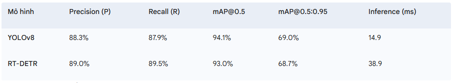
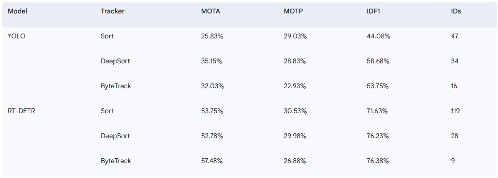

# Yolo + ByteTracker + Counting + Speeding Application (CS338)


[](https://opensource.org/licenses/MIT)

## 📝 Giới thiệu

Dự án này là một ứng dụng theo dõi đa đối tượng (MOT - Multiple Object Tracking) toàn diện, tích hợp các công nghệ tiên tiến như YOLO (You Only Look Once) để phát hiện đối tượng, ByteTrack để theo dõi, cùng với các module đếm số lượng và ước tính tốc độ phương tiện. Dự án được phát triển nhằm mục đích giáo dục trong khuôn khổ môn học CS338.

Repo này triển khai một hệ thống MOT đơn giản trên bộ dữ liệu phương tiện tự thu thập.

## ✨ Tính năng chính

* **Phát hiện đối tượng:** Sử dụng mô hình YOLO để phát hiện chính xác các phương tiện trong video.
* **Theo dõi đối tượng:** Áp dụng thuật toán ByteTrack để theo dõi liên tục các đối tượng đã phát hiện qua các khung hình, xử lý hiệu quả các trường hợp che khuất và di chuyển nhanh.
* **Đếm số lượng:** Tích hợp chức năng đếm số lượng phương tiện đi qua một khu vực hoặc đường ranh giới xác định.
* **Ước tính tốc độ:** Tính toán và hiển thị tốc độ ước tính của từng phương tiện.
* **Giao diện Streamlit:** Cung cấp một giao diện người dùng tương tác và dễ sử dụng thông qua Streamlit để chạy demo và xem kết quả trực quan.
* **Mục đích giáo dục:** Mã nguồn được tổ chức rõ ràng và sử dụng các thư viện tracking gốc để phục vụ mục đích học tập và nghiên cứu.

## 📦 Công nghệ và Thư viện sử dụng

* **YOLO:** Để phát hiện đối tượng.
* **ByteTrack:** Thuật toán theo dõi đa đối tượng hiệu quả.
* **OpenCV:** Xử lý hình ảnh và video.
* **Streamlit:** Xây dựng giao diện người dùng.
* **Numpy, Matplotlib, pandas, scikit-learn, etc.**

Dự án sử dụng và tham khảo các repo tracking gốc sau:

* **Sort:**
    * [abewley/sort](https://github.com/abewley/sort)
    * [FoundationVision/ByteTrack/yolox/sort_tracker](https://github.com/FoundationVision/ByteTrack/tree/main/yolox/sort_tracker)
* **DeepSort:**
    * [nwojke/deep_sort](https://github.com/nwojke/deep_sort)
    * [FoundationVision/ByteTrack/yolox/deepsort_tracker](https://github.com/FoundationVision/ByteTrack/tree/main/yolox/deepsort_tracker)
* **ByteTrack:**
    * [FoundationVision/ByteTrack/yolox/tracker](https://github.com/FoundationVision/ByteTrack/tree/main/yolox/tracker)

## 📂 Cấu trúc thư mục
Dưới đây là cấu trúc thư mục chính của dự án, giúp bạn dễ dàng điều hướng và hiểu rõ các thành phần:
```bash
    Vehicle_Tracking_Counting_Speeding/
├── streamlit/                      # Chứa mã nguồn cho ứng dụng giao diện web Streamlit.
├── vscode/                         # Cấu hình và thiết lập dành cho môi trường VS Code.
├── config/                         # Các file cấu hình cho ứng dụng và mô hình.
├── util/                           # Các module và hàm tiện ích chung.
├── annotations/                    # Dữ liệu annotations (nhãn) của video.
│   ├── groundtruth/                # Ground truth annotations dùng để đánh giá.
│   ├── predict/                    # Annotations dự đoán từ mô hình tracking.
│   └── txt/                        # Các file annotation dạng văn bản thô.
├── assets/                         # Tài nguyên tĩnh như ảnh, GIF, video demo.
├── video/                          # Các file video đầu vào.
├── notebook/                       # Các Jupyter Notebook để thử nghiệm và phân tích.
├── detector/                       # Mã nguồn cho mô hình phát hiện đối tượng.
├── model/                          # Các file trọng số (weights) của mô hình đã huấn luyện.
├── datamanager/                    # Module quản lý và tiền xử lý dữ liệu.
├── dataloading/                    # Các lớp và hàm để tải dữ liệu.
├── sort_tracker/                   # Triển khai thuật toán theo dõi SORT.
├── deepsort_tracker/               # Triển khai thuật toán theo dõi DeepSORT.
├── bytetrack_tracker/              # Triển khai thuật toán theo dõi ByteTrack.
├── counting/                       # Mã nguồn và logic chức năng đếm số lượng.
├── speed_estimator/                # Mã nguồn và logic chức năng ước tính tốc độ.
├── demo/                           # Các script hoặc ví dụ chạy demo.
├── evaluate/                       # Các script đánh giá hiệu suất tracking.
├── requirements.txt                # Danh sách thư viện Python cần thiết cho demo cơ bản.
├── requirements_streamlit.txt      # Danh sách thư viện Python cần thiết cho ứng dụng Streamlit.
├── LICENSE                         # Giấy phép của dự án (MIT License).
└── README.md                       # File tài liệu chính của dự án.
                  
```

## 🚀 Cài đặt và Sử dụng

Để chạy dự án, hãy làm theo các bước sau:

### 1. Chuẩn bị môi trường

Đảm bảo bạn đã cài đặt `Python 3.x` trên hệ thống của mình.

### 2. Clone Repository

```bash
git clone https://github.com/HuynhNghiaKHMT/Vehicle_Tracking_Counting_Speeding.git
cd Vehicle_Tracking_Counting_Speeding
```

### 3. Tải các mô hình đã huấn luyện
`best_weight.pt`:
Huấn luyện một mô hình phát hiện (YOLO, Fast-RCNN,...) cho các đối tượng bạn muốn theo dõi để có file mô hình tốt nhất. Hãy đặt file này vào thư mục `model/`

`ckpt.t7`:
Huấn luyện một mô hình ReID (Re-identification) cho các đối tượng để có file mô hình tốt nhất (thường dùng cho DeepSort, nhưng cũng có thể hỗ trợ ByteTrack trong một số cấu hình). Hãy đặt file này vào thư mục `model/`

### 4. Cài đặt các thư viện cần thiết
Đối với Demo ByteTrack cơ bản:
```bash
pip install -r requirements.txt
```

Đối với Demo với ứng dụng Streamlit:
```bash
pip install -r requirements_streamlit.txt
```

## 🏃 Demo
### 1. Chạy Demo ByteTrack cơ bản
Sau khi cài đặt các thư viện trong requirements.txt:
```bash
python demo_ByteTrack.py
```
Lệnh này sẽ chạy demo tracking, counting và speeding estimation trực tiếp trên video hoặc luồng dữ liệu cấu hình sẵn.

### 2. Chạy Demo với ứng dụng Streamlit
Sau khi cài đặt các thư viện trong requirements_streamlit.txt:
```bash
python -m streamlit run streamlit_app_xlsx.py
```
Lệnh này sẽ chạy demo tracking, counting và speeding estimation trực tiếp trên web và hỗ trợ xuất thống kê `vehicle_information.xlsx`.

## 🎞️ Video Demo
Dưới đây là một đoạn video/GIF ngắn minh họa hoạt động của ứng dụng Tracking, Counting và Speeding Estimation:


## 📊 Đánh giá hiệu suất
Để đánh giá hiệu suất của hệ thống tracking, bạn có thể sử dụng các script sau:

### 1. `convert.py`:
* Chức năng: Chuyển đổi định dạng các file annotation từ công cụ gắn nhãn sang định dạng tương thích với đầu ra của mô hình (thường là định dạng MOT Challenge hoặc tương tự).
* Đầu ra: Các file `anno_gt_videox.txt` (trong đó x là trạng thái hoặc ID của video), chứa ground truth annotations.

### 2. `run_ByteTrack.py`:
* Chức năng: Sử dụng mô hình tracking (ByteTrack) để xử lý video và tạo ra các dự đoán theo dõi.
* Đầu ra: Các file `anno_pred_videox.txt`, chứa các kết quả tracking dự đoán của mô hình.

### 3.`evaluate_ByteTrack.py`:
* Chức năng: Thực hiện đánh giá hiệu suất dựa trên các metrics chuẩn.
* Metrics:
    * MOTA (Multiple Object Tracking Accuracy): Một metric tổng thể, xem xét số lượng false positives, false negatives, và ID switches.
    * MOTP (Multiple Object Tracking Precision): Đo lường độ chính xác của vị trí bounding box.
    * IDF1 (ID F1 Score): Đánh giá hiệu suất duy trì ID qua thời gian.
* Cách chạy:
    ```bash
    python evaluate_ByteTrack.py
    ```
    Script này sẽ đọc các file `anno_gt_videox.txt` và `anno_pred_videox.txt` để tính toán và hiển thị các chỉ số đánh giá.

## 📊 Chỉ số đánh giá mô hình
* Dưới đây là bảng tổng hợp các chỉ số đánh giá hiệu suất của hai mô hình phát hiện **YOLOv8** và **RT-DETR**:
    
    

* Dưới đây là kết quả đánh giá hiệu suất trung bình của các mô hình theo dõi (tracking) trên 4 video khác nhau:

    

## 🤝 Đóng góp
Mọi đóng góp để cải thiện dự án đều được hoan nghênh! Vui lòng tạo một "Issue" hoặc gửi "Pull Request".

## 📄 Giấy phép
Dự án này được cấp phép theo Giấy phép MIT. Xem file LICENSE để biết thêm chi tiết.

## 📞 Liên hệ
Nếu bạn có bất kỳ câu hỏi hoặc góp ý nào, vui lòng liên hệ:

* Tên của bạn: Huỳnh Trung Nghĩa
* Email: 22520945@gm.uit.edu.vn
* GitHub: https://github.com/HuynhNghiaKHMT

## 🙏 Lời cảm ơn
Chúng tôi xin chân thành cảm ơn các nhà phát triển và cộng đồng đã tạo ra các thư viện và công cụ tuyệt vời đã giúp dự án này trở thành hiện thực. Đặc biệt cảm ơn các tác giả của SORT, DeepSort và ByteTrack.

